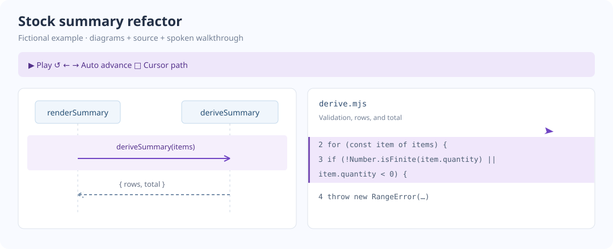

# Review Story

A skill for narrated code reviews. Diagrams, source highlights, and a pointing cursor follow the spoken explanation.

[](README.html)

**[Open the HTML README](README.html)** after cloning. It embeds the working review. GitHub's Markdown view shows the preview; the player runs in the HTML file.

The example uses fictional stock-summary code and new narration. It includes a territory map, two sequence diagrams, multiple source files, auto/manual beats, and a cursor-path toggle. No private review source or audio is included.

## Install

From this repo:

```sh
mkdir -p ~/.codex/skills
ln -s "$PWD/skills/review-story" ~/.codex/skills/review-story
```

Then request:

```text
Use $review-story to review these stacked PRs against main.
Start with the territory map, then explain the execution paths.
```

## Run the example

Open `README.html` or `docs/review.html`. The player works offline. Press Play; choose Manual to advance each beat with Space.

Rebuild with Python 3.10+:

```sh
python3 skills/review-story/scripts/build.py examples/catalog/review.json \
  --audio examples/catalog/audio --out docs/review.html --source-pages docs/source
```

For new narration, see [authoring](skills/review-story/references/authoring.md). Source lives in `examples/catalog/before` and `after`; only the latter adds quantity validation.

## Check

```sh
npm ci
npm test
```

Tests cover the example's behavior, source extraction, cue alignment, player controls, visibility calculations, and cursor geometry. DOM tests mock layout and audio; they do not replace listening or a browser check.
