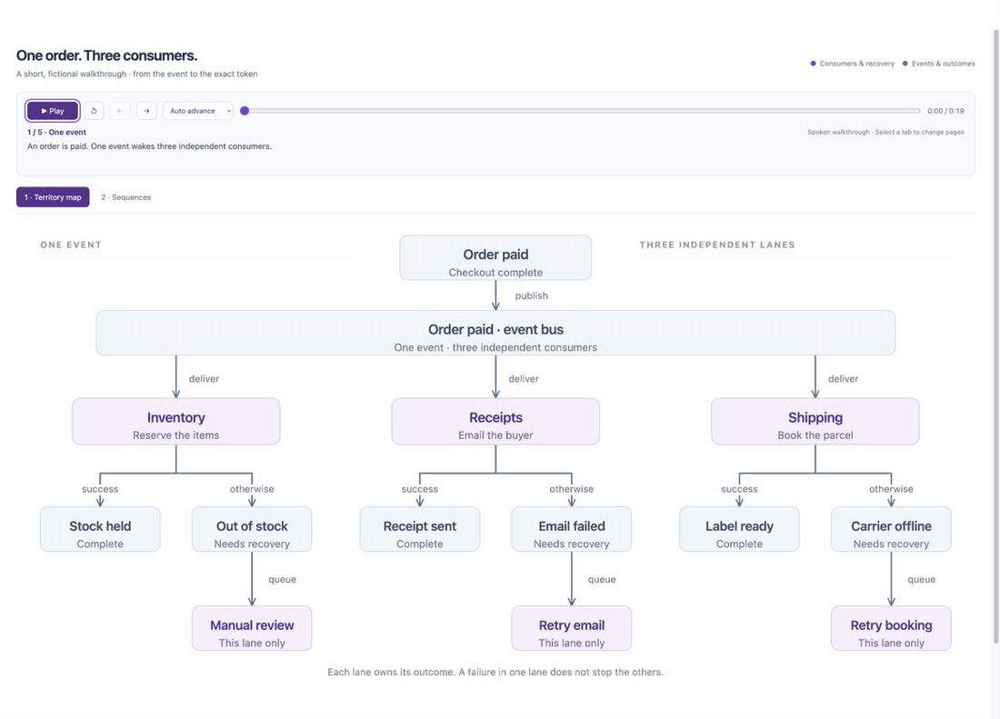

# Review Story

A skill for narrated code reviews. Diagrams, source highlights, and a cursor pointing to the exact token follow the spoken explanation.

**[▶ Try the working demo — no install needed](https://theronburger.github.io/review-story/)**

[](https://theronburger.github.io/review-story/)

GitHub strips the scripts needed to run this player inside a Markdown README. The preview above links to a GitHub Pages README with the **real, interactive player embedded**. Press Play there, or [open it full screen](https://theronburger.github.io/review-story/review.html).

**The whole demo takes 54 seconds.** Start with a familiar order-paid event and a map of inventory, receipts, and shipping. After 19 seconds, playback moves straight into two short sequences: three consumers starting together, then a receipt's calculation, payload, and retry path. The cursor slides across nearby nodes and exact tokens automatically. All source and narration were written for this fictional showcase.

## Install

```sh
git clone https://github.com/theronburger/review-story.git
cd review-story
mkdir -p ~/.codex/skills
ln -s "$PWD/skills/review-story" ~/.codex/skills/review-story
```

Then request:

```text
Use $review-story to review these stacked PRs against main.
Start with the territory map, then explain the execution paths.
```

## Explore the demo

Press Play once for the map and both sequences. Jump to **One event, three calls** for vertical pointing, or **Build and send a receipt** for the horizontal `subtotal + shipping - discount` sweep. The surrounding code stays highlighted. Choose Manual to pause after each beat and continue with Space.

After cloning, open `docs/index.html` for the embedded demo or `docs/review.html` for the standalone player. Playback works offline; full-source pages are included in `docs/source/`.

- [Showcase source and narration](examples/checkout/)
- [Extended review with a reproduced finding](examples/notices/) · [play it](https://theronburger.github.io/review-story/notices.html)
- [Smaller starter example](examples/catalog/review.json) · [play it](https://theronburger.github.io/review-story/catalog.html)
- [Authoring and speech generation](skills/review-story/references/authoring.md)

## Build and check

The demo uses pre-generated local speech and measured word timings. Rebuilding does not need speech models:

```sh
npm ci
npm run build   # Python 3.10+ and ffmpeg; embeds compact MP3 audio
npm test
```

For a WAV build using only Python:

```sh
python3 skills/review-story/scripts/build.py examples/checkout/review.json \
  --audio examples/checkout/audio --out docs/review.html --source-pages docs/source/checkout
```

Tests cover fixture behavior and the reproduced finding, source extraction, cue alignment, player controls, visibility, and cursor geometry. DOM tests mock layout and audio; browser playback is checked separately.

For GitHub Pages, publish `docs/` from `main`. Rebuild and commit the generated files to publish a demo update. Use `npm run build:extended` and `npm run build:starter` to rebuild the additional examples.
